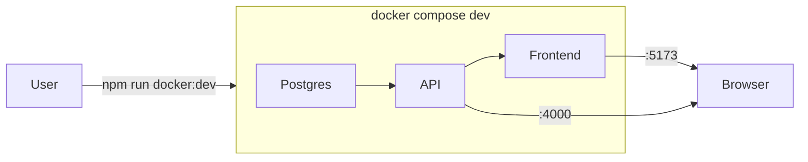

# Cleanup + Docker Dev README

## Goal

Remove leftover files from the pre-MVP migration (Capacitor, bash scripts, stale docs) and make [mercy-the-stylish-8/README.md](mercy-the-stylish-8/README.md) the **one place** to learn how to run frontend + backend with Docker for development.

---

## Files to remove

### Frontend — [mercy-the-stylish-8/app/](mercy-the-stylish-8/app/)

| File | Why remove |
|------|------------|
| [capacitor.config.ts](mercy-the-stylish-8/app/capacitor.config.ts) | Capacitor/Android removed from MVP; no `@capacitor/*` in [package.json](mercy-the-stylish-8/app/package.json) |
| [test/e2e-flow.test.ts](mercy-the-stylish-8/app/test/e2e-flow.test.ts) | Placeholder test with no real coverage |

**Keep** (still used):
- [Dockerfile.dev](mercy-the-stylish-8/app/Dockerfile.dev) — dev hot-reload via `docker-compose.dev.yml`
- [Dockerfile](mercy-the-stylish-8/app/Dockerfile) + [nginx.conf](mercy-the-stylish-8/app/nginx.conf) — production `docker-compose.yml` web service
- [vercel.json](mercy-the-stylish-8/app/vercel.json) — Vercel deploy

### Backend — [mercy-the-stylish-8/server/](mercy-the-stylish-8/server/)

| File / folder | Why remove |
|---------------|------------|
| [src/generated/](mercy-the-stylish-8/server/src/generated/) | Prisma 7 generated output; already in [.gitignore](.gitignore) (`**/src/generated/`). Delete if tracked; regenerated by `prisma generate` on install/build |

**Keep** (all active):
- [Dockerfile.dev](mercy-the-stylish-8/server/Dockerfile.dev), [docker-entrypoint.dev.sh](mercy-the-stylish-8/server/docker-entrypoint.dev.sh)
- [prisma.config.ts](mercy-the-stylish-8/server/prisma.config.ts), [prisma/](mercy-the-stylish-8/server/prisma/)
- [Dockerfile](mercy-the-stylish-8/server/Dockerfile) — production image

### Monorepo scripts

| File | Why remove |
|------|------------|
| [scripts/docker-dev.sh](mercy-the-stylish-8/scripts/docker-dev.sh) | Superseded by [scripts/docker-dev.mjs](mercy-the-stylish-8/scripts/docker-dev.mjs) (Windows-safe) |

---

## Scripts to simplify — [mercy-the-stylish-8/package.json](mercy-the-stylish-8/package.json)

Update root scripts to match frontend + backend MVP only:

```json
"install:all": "npm install --prefix server && npm install --prefix app",
"dev": "concurrently -n server,app -c blue,green \"npm run dev --prefix server\" \"npm run dev --prefix app\"",
"test:all": "npm test --prefix server && npm test --prefix app",
"build:all": "npm run build --prefix server && npm run build --prefix app"
```

Keep `docker:dev`, `docker:dev:down`, `docker:dev:logs` as-is.

---

## Replace README — [mercy-the-stylish-8/README.md](mercy-the-stylish-8/README.md)

Replace the outdated README (still mentions Capacitor, AI server, Android) with a short Docker-first guide:

**Sections:**
1. **What this is** — React storefront (`app/`) + Express API (`server/`) + Postgres
2. **Prerequisites** — Docker Desktop, Git
3. **Quick start (one command)**
   ```bash
   cd mercy-the-stylish-8
   npm run docker:dev
   ```
4. **URLs** — Frontend `http://localhost:5173`, API `http://localhost:4000`
5. **First-time env setup** — auto-creates `server/.env` and `app/.env`; list required keys (`GOOGLE_CLIENT_ID`, `JWT_SECRET`, `ADMIN_EMAILS`, Stripe keys)
6. **Useful commands** — `docker:dev:down`, `docker:dev:logs`, rebuild
7. **Troubleshooting** — Docker Desktop not running, port conflicts, re-seed (`npm run db:seed --prefix server`)
8. **Project structure** — brief tree of `app/`, `server/`, `docker-compose.dev.yml`

**Also update:**
- [README.md](README.md) at workspace root — one line pointing to `mercy-the-stylish-8/README.md`
- [DEPLOYMENT.md](DEPLOYMENT.md) — link to monorepo README for local Docker dev (avoid duplicating full instructions)

**Do not delete** (out of scope, but not in app/server):
- `ai-server/`, `android-config/`, `BUGFIXES.md`, `SETUP-CREDENTIALS.md`, `MVP-PLAN.md`

---

## Verification after cleanup

```bash
cd mercy-the-stylish-8
npm run docker:dev          # starts postgres + API + frontend
npm run build:all           # both packages build
npm test --prefix server    # server tests pass
npm test --prefix app       # app tests pass
```


