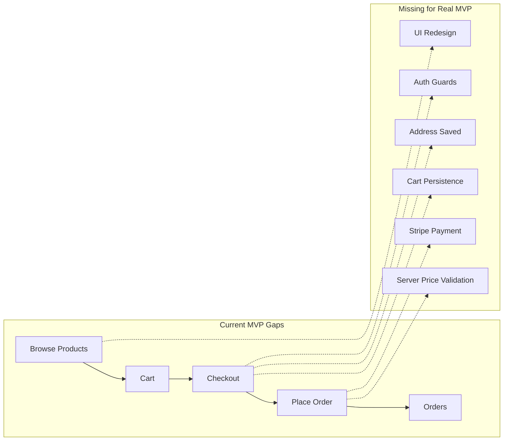
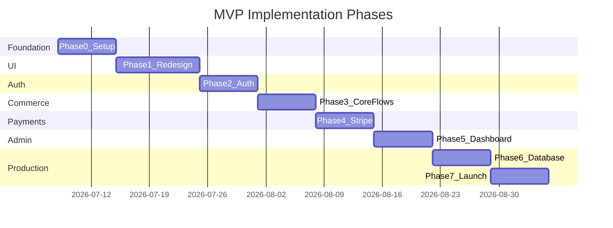

# Mercy the Stylish — MVP Phased Plan

## Current State (from codebase scan)

The project is a **monorepo** inside [`mercy-the-stylish-8/`](mercy-the-stylish-8/) with:

| Layer | Current stack | What works today |
|-------|---------------|------------------|
| Frontend | Vanilla TS + Vite + hash router + plain CSS | Shop, cart, checkout, orders, account, admin dashboard |
| Backend | Express 4 + TS + Zod + JSON files | Products CRUD, orders, Google→JWT auth, admin email allowlist |

**Out of scope for this MVP:** `ai-server/`, Capacitor/Android/iOS, AI stylist panel.

**Critical gaps blocking a real MVP today:**
- Checkout collects address but **does not send it** to the API ([`app/src/pages/Checkout.ts`](mercy-the-stylish-8/app/src/pages/Checkout.ts))
- Cart is **in-memory only** — lost on refresh ([`app/src/store.ts`](mercy-the-stylish-8/app/src/store.ts))
- Server **trusts client price/total** on order create ([`server/src/routes/orders.ts`](mercy-the-stylish-8/server/src/routes/orders.ts))
- No **Stripe payment** flow
- Auth has no route guards, no JWT expiry UX, admin role baked into JWT
- UI is functional but not production-grade (innerHTML pages, duplicated logic, no component system)

---

## Recommended Frameworks (easy migration)

### Frontend: **React + Vite + React Router + Tailwind CSS**

**Why this is the best fit:**
- **Already on Vite** — keep [`vite.config.ts`](mercy-the-stylish-8/app/vite.config.ts), build pipeline, and Vercel deploy config
- **Incremental migration** — port one page at a time; existing [`types.ts`](mercy-the-stylish-8/app/src/types.ts) and [`api.ts`](mercy-the-stylish-8/app/src/api.ts) map directly to React hooks/services
- **UI redesign at scale** — Tailwind + [shadcn/ui](https://ui.shadcn.com) gives polished e-commerce components fast
- **Auth/routing** — React Router replaces custom hash router with proper protected routes
- **Web-only MVP** — drop `@capacitor/*` and `@codetrix-studio/capacitor-google-auth`; use Google Identity Services (already loaded in [`index.html`](mercy-the-stylish-8/app/index.html)) + `localStorage` for session

**Migration effort:** Medium — rewrite pages, but business logic and API contracts stay the same.

**Not recommended for MVP:**
- **Next.js** — bigger jump (SSR/routing model change) for little gain on a storefront SPA hosted on Vercel
- **Stay vanilla** — fastest short-term, but redesign + auth guards + Stripe will become harder to maintain

### Backend: **Keep Express + TypeScript, add Prisma + PostgreSQL**

**Why this is the best fit:**
- Route handlers in [`server/src/routes/`](mercy-the-stylish-8/server/src/routes/) and Zod validation in [`validation.ts`](mercy-the-stylish-8/server/src/validation.ts) stay largely intact
- Swap only the persistence layer: [`db.ts`](mercy-the-stylish-8/server/src/db.ts) JSON files → Prisma models
- Stripe webhooks fit naturally as new Express routes
- README already points to Postgres/Prisma for production

**Migration effort:** Low–medium — replace `productsDb`/`ordersDb` calls with Prisma queries; add `User`, `Address`, `Payment` models.

**Not recommended for MVP:**
- **NestJS** — full restructure for little MVP benefit
- **Fastify/Hono** — minor gains, unnecessary churn

### Supporting libraries (add during implementation)

| Concern | Library |
|---------|---------|
| Data fetching | TanStack Query |
| Forms | React Hook Form + Zod (shared schemas with backend) |
| Payments | Stripe Checkout or Payment Intents |
| Auth (web) | Google Identity Services + JWT in `localStorage` |
| API client | Keep thin `fetch` wrapper or migrate to `ky` |

---

## Deliverable: Plan Markdown File

On approval, create **[`MVP-PLAN.md`](MVP-PLAN.md)** at repo root (`d:\help\mercy-the-stylish-8\MVP-PLAN.md`) containing this full phased roadmap, checklist per phase, and acceptance criteria. Implementation happens phase-by-phase after that.

---

## Phase 0 — Foundation & Migration Setup (Week 1)

**Goal:** Prepare the codebase for redesign without breaking existing flows.

### Frontend
- Scaffold React inside [`app/`](mercy-the-stylish-8/app/) (Vite React template or manual `@vitejs/plugin-react`)
- Add Tailwind CSS; port design tokens from [`style.css`](mercy-the-stylish-8/app/src/style.css) (`--cream`, `--rose`, `--plum`, etc.)
- Remove from MVP build scope: AI stylist UI in [`layout.ts`](mercy-the-stylish-8/app/src/components/layout.ts), `chatWithStylist` calls, Capacitor plugins
- Set up folder structure: `src/components/`, `src/pages/`, `src/hooks/`, `src/lib/api.ts`

### Backend
- Add `requireAuth` middleware (complement existing `optionalAuth` in [`auth.ts`](mercy-the-stylish-8/server/src/middleware/auth.ts))
- Enforce `JWT_SECRET` in production (fail fast if default)
- Tighten CORS to frontend origin(s)
- Add `helmet` + basic rate limiting on `/api/auth` and `/api/orders`

### Acceptance criteria
- `npm run dev` still works for both `app/` and `server/`
- React app shell renders with existing brand colors
- No AI/Android dependencies required for web MVP

---

## Phase 1 — UI Redesign: Design System + Storefront Shell (Week 1–2)

**Goal:** Professional, mobile-first storefront UI.

### Build
- App shell: sticky header, cart badge, bottom nav (Shop / Orders / Account / Dashboard-admin-only)
- Reusable components: `Button`, `Input`, `Card`, `Badge`, `Modal`, `Toast`, `Skeleton`, `EmptyState`
- Redesign pages (read-only flows first):
  - **Home** — hero, category chips, product grid, search
  - **Product detail** — image gallery placeholder, qty stepper, stock badge, add-to-cart CTA
  - **Cart** — line items, qty edit, remove, subtotal

### UX fixes included
- Cart count badge in header (uses existing `cartCount()` logic)
- Image fallback on broken URLs
- Consistent loading/error states
- Replace hash routing with React Router (`/`, `/product/:id`, `/cart`, etc.) — configure Vercel SPA rewrites

### Acceptance criteria
- Storefront looks cohesive and mobile-first
- Browse → product → cart works end-to-end with new UI
- Lighthouse mobile score baseline captured

---

## Phase 2 — Authentication & Authorization (Week 2–3)

**Goal:** Secure, clear sign-in and role-based access.

### Frontend
- Google Sign-In via web GIS (replace Capacitor Google Auth)
- Session: store JWT + user profile in `localStorage`
- **Protected routes:** `/checkout`, `/orders`, `/dashboard`
- **Admin-only route:** `/dashboard` — redirect non-admins
- JWT expiry handling: detect 401 → prompt re-login toast/modal
- Account page: profile, sign out

### Backend
- Add `requireAuth` to order routes (replace inline `if (!req.user)` checks)
- Recompute `isAdmin` from `ADMIN_EMAILS` on each request (don't trust stale JWT flag alone)
- Require `email_verified` from Google token
- Add `GET /api/auth/me` for session refresh

### Authorization matrix (target)

| Route | Guest | Customer | Admin |
|-------|-------|----------|-------|
| Products read | Yes | Yes | Yes |
| Cart/checkout UI | Browse only | Yes | Yes |
| Orders | No | Own | All |
| Dashboard | No | No | Yes |
| Product write | No | No | Yes |

### Acceptance criteria
- Guest cannot access checkout/orders/dashboard
- Admin sees dashboard; customer does not
- Expired token shows friendly re-auth flow

---

## Phase 3 — Core Commerce Flows (Week 3–4)

**Goal:** Complete, trustworthy buy flow before payments.

### Frontend
- **Cart persistence** — `localStorage` save/load on change
- **Checkout form** — name, phone, delivery address (required fields)
- **Order detail page** — `/orders/:id` with items, address, status timeline
- **Orders list** — status badges, date, total
- Disable place-order button during API call; show stock errors clearly

### Backend
- Extend `Order` model: `shippingAddress`, `customerName`, `customerPhone`
- **Server-side price recalculation** — ignore client `total`; load product prices from DB at order time
- `GET /api/orders/:id` with ownership check (customer = own order only)
- Restore stock when admin sets status to `cancelled`
- Basic product pagination: `GET /api/products?page=&limit=&category=&search=`

### Acceptance criteria
- Cart survives page refresh
- Address appears on created order
- Client cannot manipulate order total
- Customer can view order detail; admin can view any order

---

## Phase 4 — Stripe Payments (Week 4–5)

**Goal:** Paid checkout — user selected Stripe for MVP.

### Backend
- Add Stripe SDK; env vars: `STRIPE_SECRET_KEY`, `STRIPE_WEBHOOK_SECRET`, `STRIPE_PUBLISHABLE_KEY`
- `POST /api/payments/create-checkout-session` — creates Stripe Checkout Session from cart items (server-validated prices)
- `POST /api/webhooks/stripe` — handle `checkout.session.completed`
- Order lifecycle: `pending_payment` → `paid` → `confirmed` → `shipped` → `delivered`
- Only decrement stock after successful payment (move stock logic from Phase 3 create-order to payment confirmation)

### Frontend
- Checkout: review order → pay with Stripe → redirect to success/cancel pages
- Success page: order confirmation + order ID
- Orders page shows payment status

### Acceptance criteria
- Test mode Stripe payment completes end-to-end
- Unpaid orders do not reduce stock
- Webhook idempotency handled

---

## Phase 5 — Admin Dashboard Redesign (Week 5–6)

**Goal:** Usable back-office for daily operations.

### Frontend
- Dashboard overview: total orders, revenue (paid), pending orders, low-stock count
- **Products tab:** table/cards, add/edit form (modal or dedicated page), delete confirmation
- **Orders tab:** filter by status, update status dropdown, view customer + address + items
- Responsive tables for mobile admin use

### Backend
- `GET /api/admin/stats` — order count, revenue, low-stock products
- Validate admin on all write endpoints (already partially done via `requireAdmin`)

### Acceptance criteria
- Admin can manage full product lifecycle
- Admin can move orders through status workflow
- Non-admin gets 403 on admin APIs

---

## Phase 6 — Database Migration & Production Hardening (Week 6–7)

**Goal:** Move off JSON files; make deployable.

### Backend
- Prisma schema: `Product`, `Order`, `OrderItem`, `User` (optional cache of Google profile)
- Migrate seed data from [`server/data/products.json`](mercy-the-stylish-8/server/data/products.json)
- Deploy Postgres (Neon/Supabase/Railway)
- Env validation on boot (zod or envalid)
- Structured logging for payment webhooks and order errors

### DevOps
- Update [`DEPLOYMENT.md`](DEPLOYMENT.md) with backend host + Stripe webhook URL setup
- Vercel env vars: `VITE_MAIN_SERVER_URL`, `VITE_GOOGLE_CLIENT_ID`, `VITE_STRIPE_PUBLISHABLE_KEY`
- Health checks + smoke test script updates

### Acceptance criteria
- Data persists across server restarts
- No JSON file race conditions
- Production deploy documented end-to-end

---

## Phase 7 — MVP Launch Polish (Week 7–8)

**Goal:** Ship with confidence.

- E2E test: browse → cart → Stripe test payment → order visible
- Error boundaries + global toast notifications
- 404 page, empty cart state, empty orders state
- Basic SEO: page titles, meta description on home
- Accessibility pass: focus states, button labels (replace emoji-only nav)
- Remove dead code: AI API methods, Capacitor config from web build

### MVP launch checklist
- [ ] Google OAuth configured for production domain
- [ ] Stripe live/test keys set per environment
- [ ] Admin emails configured
- [ ] CORS locked to frontend URL
- [ ] `.gitignore` prevents `node_modules`/`.env` commits

---

## What we are NOT building in MVP

- Android/iOS native apps
- AI stylist chat / recommendations
- Product variants (size/color)
- Coupons, tax, multi-currency
- Email notifications (can be Phase 8)
- Image upload (URL-only for v1; Cloudinary in Phase 8)

---

## Suggested implementation order

**Start with Phase 0**, then implement **one phase at a time** with a working demo after each.

---

## Key files that will change most

| Phase | Primary files |
|-------|---------------|
| 0–1 | [`app/package.json`](mercy-the-stylish-8/app/package.json), new `app/src/pages/*`, `app/src/components/*` |
| 2 | [`app/src/auth/`](mercy-the-stylish-8/app/src/auth/), [`server/src/middleware/auth.ts`](mercy-the-stylish-8/server/src/middleware/auth.ts), [`server/src/routes/auth.ts`](mercy-the-stylish-8/server/src/routes/auth.ts) |
| 3 | [`Checkout.ts`](mercy-the-stylish-8/app/src/pages/Checkout.ts) → React checkout, [`server/src/routes/orders.ts`](mercy-the-stylish-8/server/src/routes/orders.ts), [`validation.ts`](mercy-the-stylish-8/server/src/validation.ts) |
| 4 | New `server/src/routes/payments.ts`, `server/src/routes/webhooks.ts` |
| 5 | New admin React pages |
| 6 | Replace [`server/src/db.ts`](mercy-the-stylish-8/server/src/db.ts) with Prisma |
